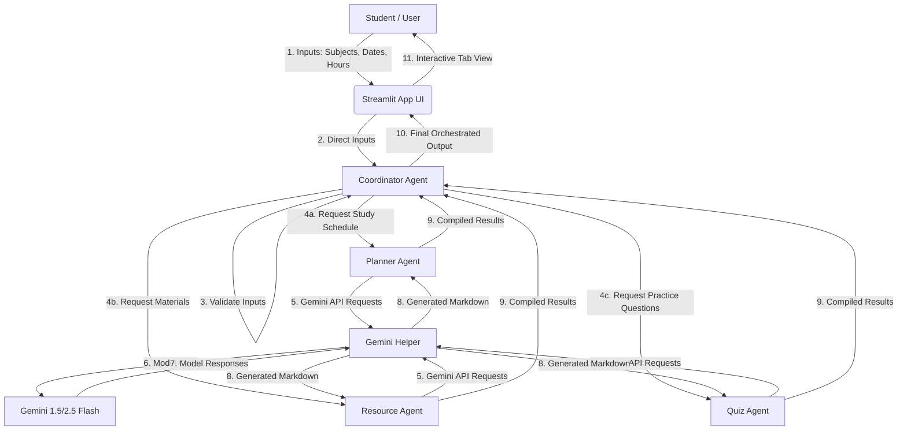

# 🎓 StudyMate AI

**StudyMate AI** is a beginner-friendly, multi-agent study assistant built for the **Kaggle "AI Agents: Intensive Vibe Coding Capstone Project"**. 

Using a simple but powerful multi-agent architecture, StudyMate AI transforms basic student inputs—subjects, upcoming exam dates, and available daily study hours—into a highly structured study plan, hand-picked free learning resources, and interactive practice quizzes.

---

## 💡 Problem Statement & Solution

### The Problem
Preparing for multiple upcoming exams can be overwhelming. Students often struggle to:
- Estimate how much time to allocate to each subject.
- Find high-quality, reputable learning materials without wasting time searching.
- Generate relevant practice questions for self-assessment (active recall).

### The Solution
**StudyMate AI** acts as a personal academic advisor by coordinating four specialized AI agents to automate these pain points:
1. **Coordinator Agent**: Validates inputs, coordinates sub-agents, and produces a summary.
2. **Planner Agent**: Schedules time dynamically based on date urgency.
3. **Resource Agent**: Suggests courses, videos, and books with direct links.
4. **Quiz Agent**: Generates testing material with interactive "click-to-reveal" solutions.

---

## 🏛️ Multi-Agent Architecture

The project features a modular multi-agent workflow where a master coordinator delegates tasks to specialized worker agents, who query the Gemini LLM via a shared helper:



- **Coordinator Agent** (`agents/coordinator_agent.py`): The supervisor. It receives input, runs validation, executes the worker agents, compiles their results, and generates a welcome briefing.
- **Planner Agent** (`agents/planner_agent.py`): Calculations-oriented. It calculates time remaining and structures a custom curriculum.
- **Resource Agent** (`agents/resource_agent.py`): Reference librarian. It curates reputable educational sources with clear hyperlinks.
- **Quiz Agent** (`agents/quiz_agent.py`): Test examiner. It drafts exact practice questions and wraps responses in HTML details tags for self-assessment.

---

## 📂 Project Structure

```
StudyMate-AI/
├── app.py                  # Main Streamlit user interface & orchestration entrypoint
├── requirements.txt        # Python libraries required
├── README.md               # Setup and usage guide (this file)
├── .env.example            # Template for storing secrets
├── agents/                 # Agent classes
│   ├── base_agent.py       # Abstract BaseAgent parent class
│   ├── coordinator_agent.py# Coordinates & orchestrates sub-agents
│   ├── planner_agent.py    # Generates study schedule
│   ├── resource_agent.py   # Recommends learning resources
│   └── quiz_agent.py       # Generates practice questions
├── utils/                  # Helper utilities
│   └── gemini_helper.py    # Gemini API wrapper with error handling
└── assets/                 # Folder for styling images and visual assets
    └── .gitkeep            # Empty file keeping folder in Git tracking
```

---

## 🛠️ Setup & Local Installation

Follow these steps to run StudyMate AI on your local computer.

### Prerequisites
- Python 3.11 or newer installed on your computer.
- A Google account (to obtain a free Gemini API Key).

### Step 1: Clone or Copy the Repository
Navigate to the directory in your command line or IDE terminal:
```bash
cd StudyMate-AI
```

### Step 2: Create a Virtual Environment
It is highly recommended to isolate your project dependencies using a virtual environment:

- **On Windows (Command Prompt / PowerShell)**:
  ```bash
  python -m venv venv
  venv\Scripts\activate
  ```
- **On macOS / Linux**:
  ```bash
  python3 -m venv venv
  source venv/bin/activate
  ```

### Step 3: Install Dependencies
Install all required libraries using pip:
```bash
pip install -r requirements.txt
```

### Step 4: Configure the Gemini API Key
1. Go to [Google AI Studio](https://aistudio.google.com/) and click **Get API Key** to generate a free key.
2. In the root directory of your project, copy `.env.example` to a new file named `.env`:
   ```bash
   cp .env.example .env
   ```
3. Open `.env` in a text editor and replace `your_gemini_api_key_here` with your actual API key:
   ```env
   GEMINI_API_KEY=AIzaSyYourActualKeyHere
   ```

---

## 🚀 Running the App Locally

Start the Streamlit application:
```bash
streamlit run app.py
```
This will automatically open your web browser to `http://localhost:8501`. If it doesn't open, copy-paste the URL into your browser.

**How to Use the App:**
1. Insert your **API key** in the sidebar (if it is not already loaded from `.env`).
2. Input your **Subjects** separated by commas.
3. Select the **Exam Date** for each subject using the calendar inputs.
4. Set your **Available Study Hours per day**.
5. Click **Generate Study Plan & Materials** and watch the agents collaborate in real time!

---

## 🌐 Deployment to Streamlit Community Cloud

Streamlit Community Cloud is a free hosting service. You can deploy this project in just a few minutes:

### Step 1: Upload to GitHub
1. Create a public repository on GitHub.
2. Initialize git in your local project directory, add your files, and push to GitHub:
   ```bash
   git init
   git add .
   git commit -m "Initial commit of StudyMate AI"
   git branch -M main
   git remote add origin https://github.com/your-username/your-repo-name.git
   git push -u origin main
   ```
   > [!WARNING]
   > Make sure **never** to upload your `.env` file to GitHub! The project's `.gitignore` should ignore `.env` files.

### Step 2: Set Up Streamlit Community Cloud
1. Visit [share.streamlit.io](https://share.streamlit.io/) and log in with your GitHub account.
2. Click **New app** (or **Deploy an app**).
3. Select your repository, the `main` branch, and set the Main file path to `app.py`.

### Step 3: Add API Key Secrets securely
Before clicking deploy, you must tell Streamlit what your Gemini API key is:
1. In the app settings on Streamlit Cloud, find the **Secrets** section.
2. Paste the contents of your `.env` file there:
   ```toml
   GEMINI_API_KEY = "AIzaSyYourActualKeyHere"
   GEMINI_MODEL = "gemini-1.5-flash"
   ```
3. Click **Save** and then click **Deploy!** Your app will be live and accessible to anyone via a public link.
